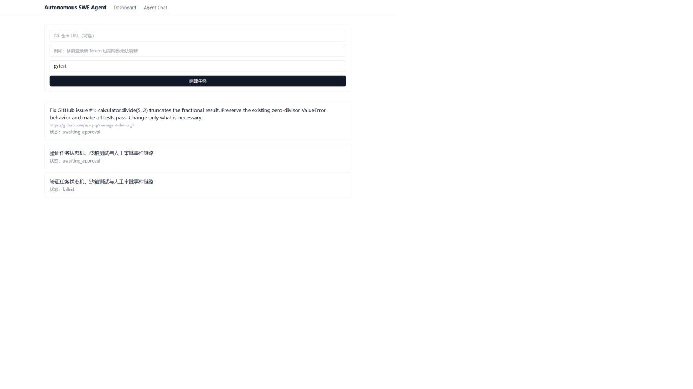
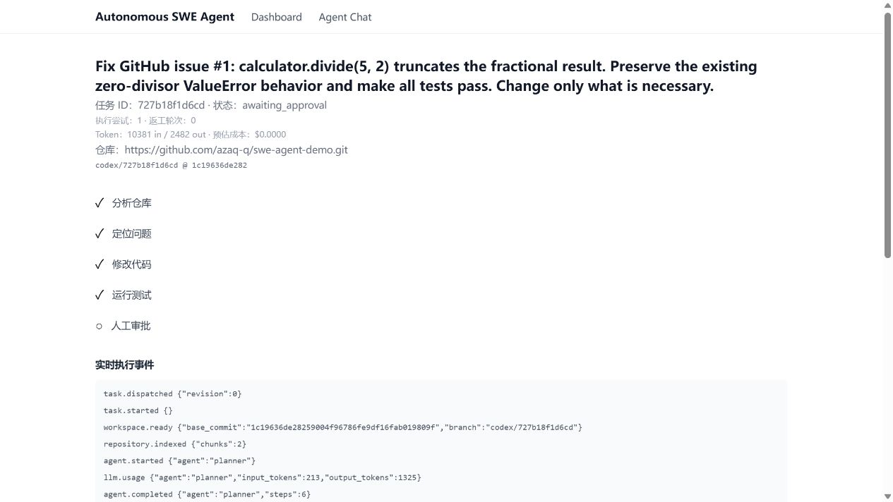
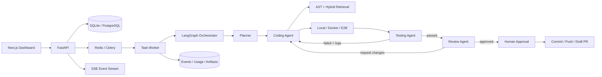

# Autonomous SWE Agent

一个面向软件工程任务的自主 Agent 原型：通过 Planner、Coding、Testing 和 Review
工作流修改代码、运行测试、记录执行结果，并在人工审批后结束任务。

> 当前重点是可靠编排与安全执行。GitHub Clone/Push/Draft PR、混合检索和可复现评测框架
> 已实现；真实任务数据集与付费模型成绩尚未产出，不将 mock 或示例结果冒充实测成绩。

## 真实演示

[公开演示 Issue #1](https://github.com/azaq-q/swe-agent-demo/issues/1) 固定在提交
`1c19636de28259004f96786fe9df16fab019809f`。Agent 在一次迭代中修复浮点除法错误，
标准库回归测试 `2/2` 通过，结构化 Review 判定 `approve`，并生成 349-byte binary patch
（SHA-256 `e83fa7d9100515af8cdbbe639d1ad7d461a2237d2b62fcafd87c7fc0d89b425b`）。
同一修复已发布为[公开 Draft PR #2](https://github.com/azaq-q/swe-agent-demo/pull/2)。





## 已实现

- FastAPI + SQLAlchemy 任务 API，支持仓库元数据、测试命令和最大迭代次数
- 每任务独立 clone/workspace，固定基础提交并创建 `codex/<task_id>` 工作分支
- 导出包含新增文件的 binary patch，记录 SHA-256 并通过受限 API 下载
- LangGraph 显式工作流，依据测试退出码重试，达到预算后可靠失败
- 测试失败日志反馈给 Coding Agent，执行摘要持久化到数据库
- 人工审批 API 和前端任务时间线
- Local / Docker / E2B 沙箱抽象
- Docker 默认关闭网络并限制 CPU、内存、PID 和 Linux capabilities
- Python 代码边界分块、BM25 检索、Recall@k / MRR 指标
- Alembic 数据库迁移、后端测试和 GitHub Actions CI
- Celery/Redis 生产任务分发，稳定 dispatch ID、延迟确认和指数退避
- LangGraph SQLite checkpoint、崩溃续跑与协作式任务取消
- 结构化 Review，可自动返工；人工批准/返工记录写入审计表
- 审批后独立发布任务执行 commit、幂等 push 和 GitHub Draft PR
- append-only 执行事件、SSE 实时轨迹、token 与可配置成本统计
- Tree-sitter 多语言 AST 分块和 BM25/向量 RRF 混合检索
- 固定源 commit 的 JSONL benchmark runner 与可复现指标报告

## 架构



执行语义强调可恢复和可审计：任务绑定固定源提交，分发使用稳定 ID，测试按退出码路由，
Review 与人工审批分别持久化，发布操作可重试且不会重复创建 PR。

## 工程证据

| 能力 | 当前证据 |
| --- | --- |
| 可靠性 | 有限重试、checkpoint 恢复、协作式取消、幂等发布 |
| 安全性 | workspace 路径边界、符号链接逃逸测试、Docker 断网与资源限制 |
| 可观测性 | append-only 事件、SSE 轨迹、token/成本统计 |
| 质量 | Ruff、65 passed / 1 skipped、Alembic 全量迁移、前端生产构建 |
| 部署 | 非 root 前后端镜像、PostgreSQL/Redis/Worker 演示 Compose |

当前公开案例用于验证工程闭环，不等同于统计意义上的模型成绩。解决率、稳定性和成本结论将在
20+ 固定提交任务的 Benchmark 完成后发布；当前仓库不使用 mock 数字作为项目成绩。

## 本地运行

要求：Python 3.12、[uv](https://docs.astral.sh/uv/)、Node.js 20+。

```powershell
cd backend
uv sync --locked
uv run alembic upgrade head
uv run uvicorn app.main:app --reload
```

```powershell
cd frontend
npm ci
npm run dev
```

打开 `http://localhost:3000`。未配置 LLM Key 时系统进入明确标记的 mock 模式；配置
`OPENAI_API_KEY` 或 `ANTHROPIC_API_KEY` 后启用真实编排。环境变量示例见 `.env.example`。

生产任务队列可设置 `TASK_BACKEND=celery`，然后启动 Worker：

```powershell
cd backend
uv run celery -A app.worker.celery_app:celery_app worker --loglevel=info
```

审批 GitHub 仓库任务前配置具有 Contents/Pull requests 写权限的 `GITHUB_TOKEN`。
Token 只通过子进程环境中的临时 Git 认证头使用，不写入 remote URL、日志或数据库。

## 评测

每条评测任务必须固定 `source_commit`。复制
`backend/evals/datasets/schema.example.jsonl` 并替换为真实任务后运行：

```powershell
cd backend
uv run python -m app.evals.benchmark evals/datasets/my-benchmark.jsonl `
  --output benchmark-results.json
```

报告包含解决率、测试通过率、patch 生成率、平均迭代次数和 P50/P95 耗时。
项目不会把 schema 示例或 mock 结果冒充真实评测成绩。

## 验证

```powershell
cd backend
uv run ruff check .
uv run pytest -q

cd ../frontend
npm run build
```

## 安全说明

`local` provider 会在宿主机执行 shell，仅用于可信的本地开发。运行不可信 Agent 命令时应选择
Docker 或 E2B。路径访问始终限制在 workspace 内；Docker provider 还会关闭网络、丢弃
capabilities 并限制资源。容器隔离并不等同于虚拟机隔离，生产环境仍应增加镜像白名单、审计、
密钥代理和节点级隔离。

## 容器化演示

```powershell
docker compose -f docker-compose.yml -f docker-compose.demo.yml up --build
```

该 Compose 文件用于端到端演示：Worker 自身是容器，但内部使用 LocalSandbox。生产部署应把
不可信代码执行迁移到独立 sandbox service、E2B 或 microVM，不应把演示 Compose 当作生产隔离。

已验证的演示验收条件包括：数据库迁移成功、全部服务健康、镜像不包含 `.env`、任务一次分发后
进入 `awaiting_approval`。录屏镜头和脱敏检查清单见
[`docs/demo-script.md`](docs/demo-script.md)。

## 下一里程碑

1. 使用真实缺陷扩充 20+ 任务评测集并提交可复核报告
2. 接入 GitHub App installation token，替代单租户开发 Token
3. 将执行面迁移到独立 sandbox service 或 microVM
4. 对混合检索、reranker 和编排策略完成消融实验

更完整的产品设计与进度记录见 [`docs/`](docs/)。
